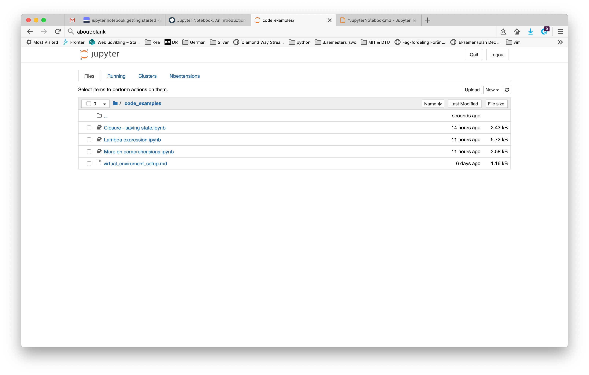

# Getting started with Jupyter Notebook

## Prequisite
Before you install Jupyter Notebook on your system, it is a good idea to set up a [Virtual Enviroment
](../code_examples/virtual_enviroment_setup.md). Jupyter Notebook is a rather large set of files and dependencies, and by putting it in its own enviroment you make it easy for yourself if you at a later place want to change or delete the instalation. 


## Installation

```
    > pip install jupyter
```
## Starting the Jupyter Notebook Server
To start a Jupyter Notebook instance with the parent folder as root: 

```
    > jupyter notebook
```   

A browser window will open and from here on you will work with Jupyter Notebook in the browser. 


   

## Stopping the Notebook
To stop Jupyter Notebook, close your browser window(s), and in terminal press "ctrl+c" and press "Y" and hit enter. 


## Alternatives
Jupyter Notebook can also be used through different alternatives. 
### Anaconda
Anaconda is a cluster of tolls and functionality, including jupyter notebook. You will not need all the exstra functionality that comes with anaconda, but if you like you can also have jupyter notebook installed through instaling Anaconda.

### Azure Notebooks
A cloud version of jupyter notebook can be found at https://notebooks.azure.com/  


